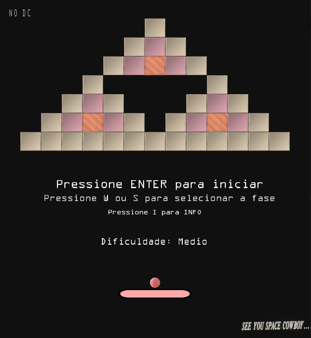
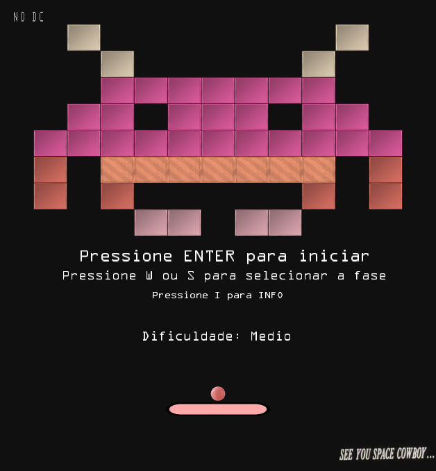
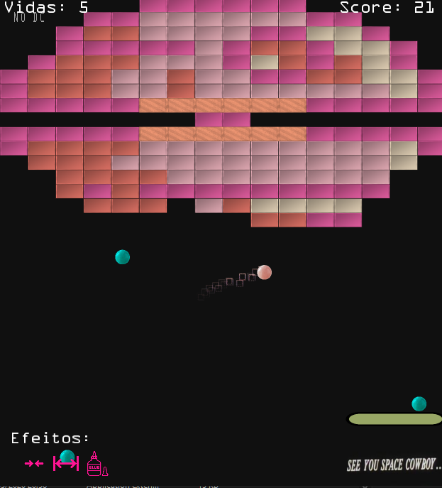
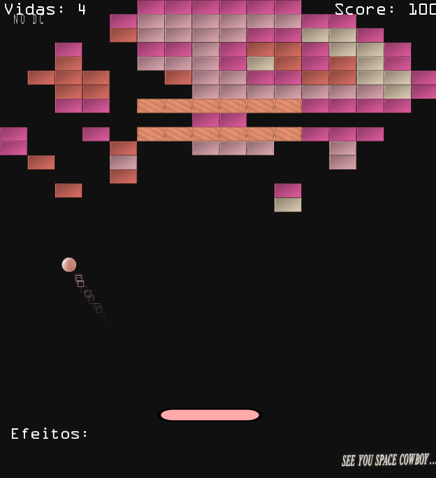

# Tijolator
This is a 2d breakout game that I made in order to learn more about openGL and shaders in general. The game has multiple levels available from the main menu, as well as 3 difficulty settings: Easy, Medium and Hard. The language of the game is portuguese, but gameplay is not very influenced by language, so anyone can enjoy it!

# Controls
On the main menu:
- "W" and "S": Choose game level
- "1", "2" and "3": Choose game difficulty
- "I": display help menu
- "Enter": Play the game
- "Q": Quit the game

During the game:
- Mouse position: Moves the bar. This is relative to the center of the screen, not to the bar's position.
- Left mouse button: Pause/unpause the game
- Right mouse button: Display debug info
- Space: Launch the ball from the bar
- "R": Restart the game

# Game difficulties
- Easy (Facil)
    - Negative power ups will not spawn
    - The bar moves at a faster speed
    - Power ups are better
    - 5 lives
- Medium (Medio)
    - Negative power ups can spawn
    - The bar is slower
    - Normal power ups
    - 3 lives
- Hard (Dificil)
    - Increased chance for negative power ups
    - The bar is the slowest
    - Power ups are worse
    - 2 lives
    - Honestly very hard to complete levels in this difficulty

# Images

  
  
  
  

